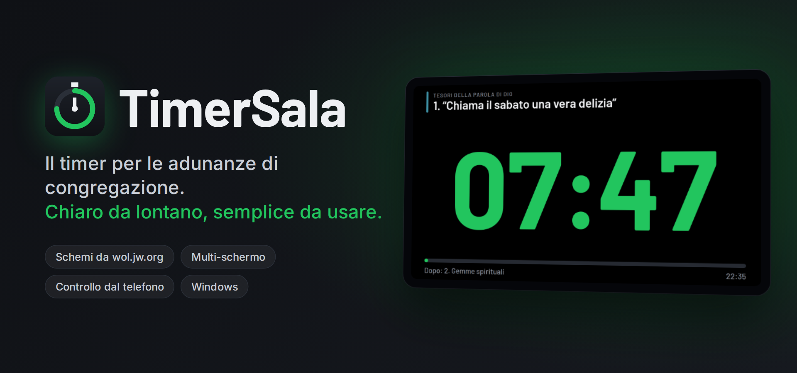
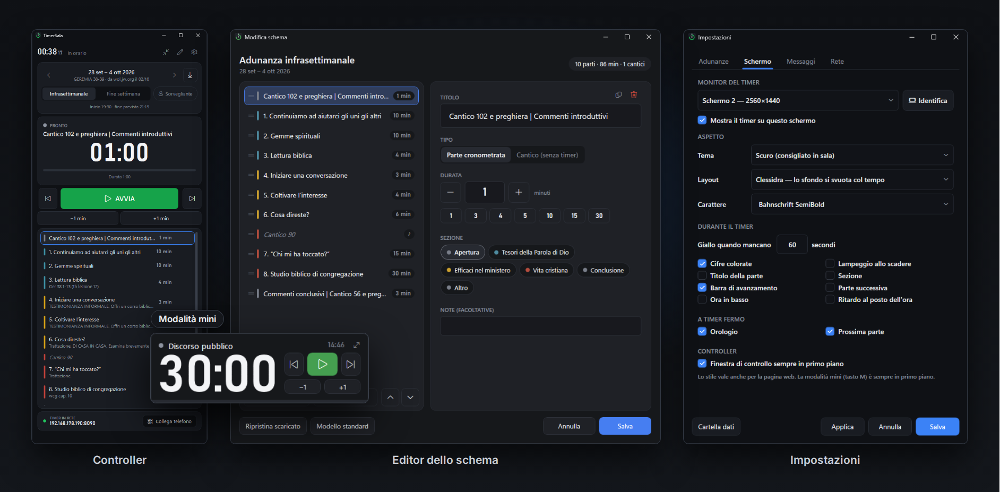
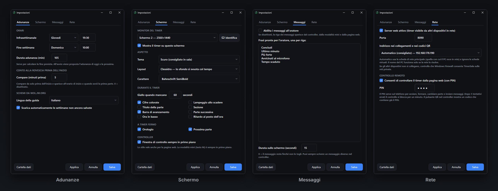
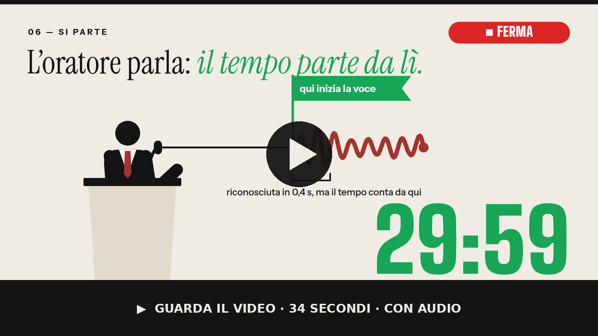
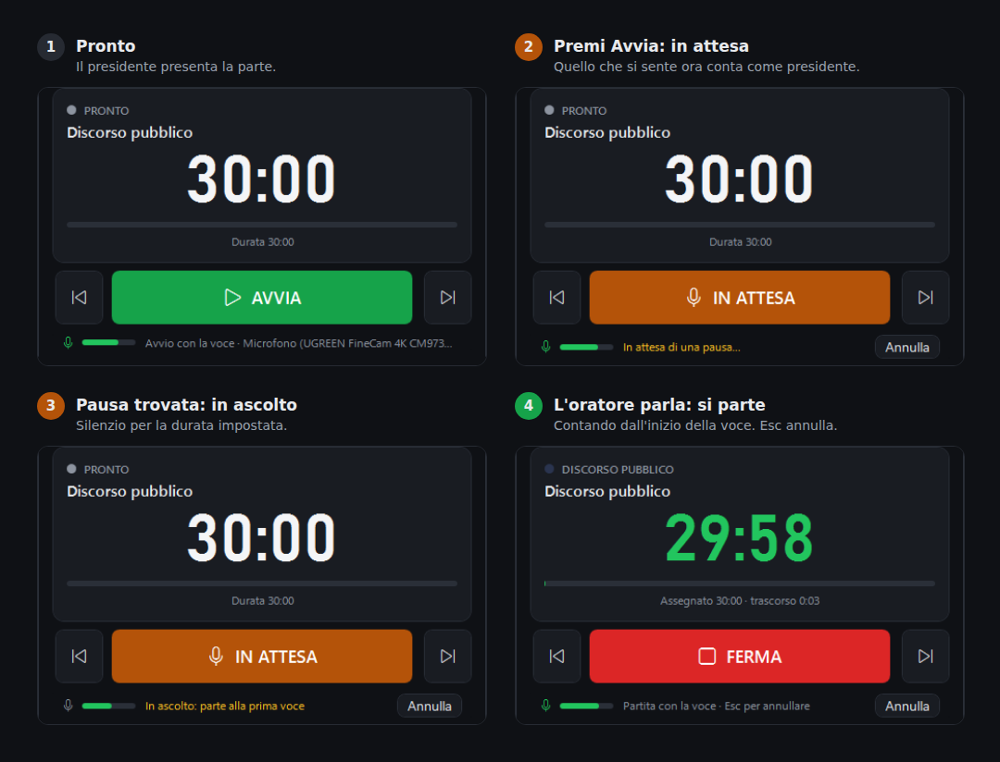
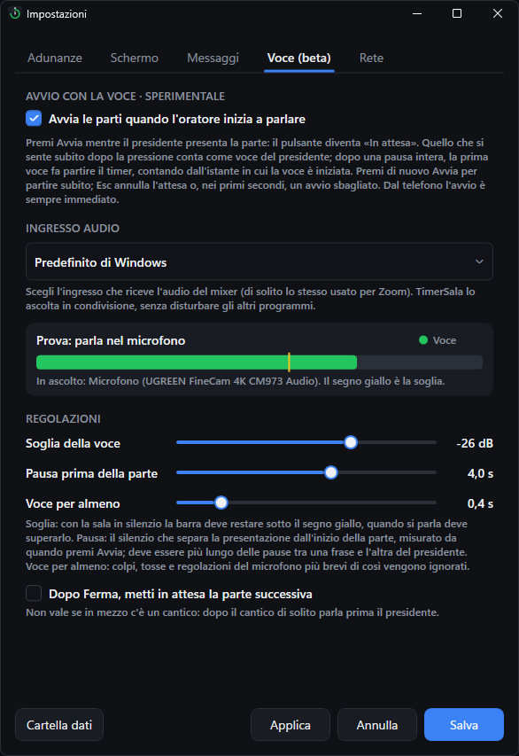
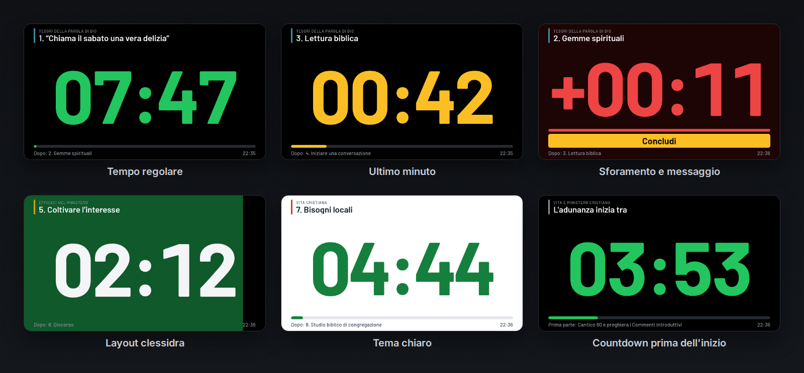
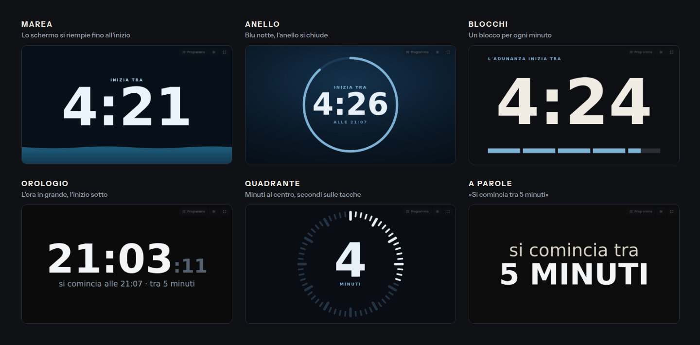
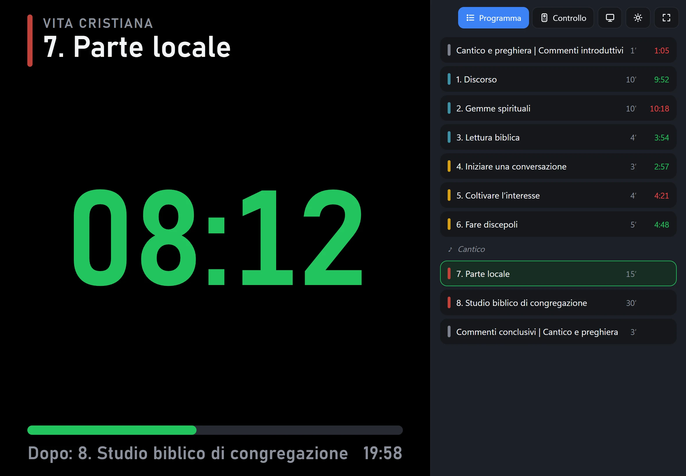
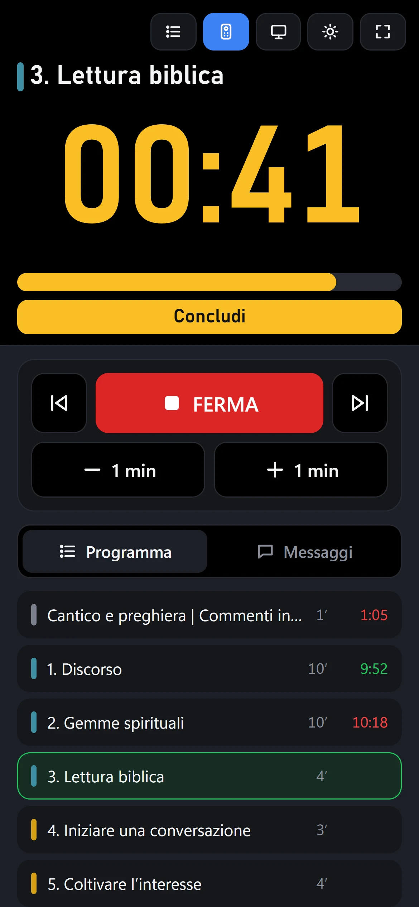

<p align="center">
  
</p>

<p align="center">
  <a href="https://github.com/Lomme89/timersala/releases/latest"></a>
  <a href="https://lomme89.github.io/timersala/"></a>
</p>

<p align="center">
  
  
  
  
</p>

<p align="center">
  Un unico file da avviare: lo schema della settimana arriva da <b>wol.jw.org</b>, il timer va sullo schermo che scegli<br>
  e chiunque in sala può seguirlo, o comandarlo, dal telefono.
</p>

---

## ✨ Cosa fa

<table>
<tr>
<td width="50%" valign="top">

**📥 Schemi automatici**<br>
Parti, durate e cantici dell'infrasettimanale e lo studio Torre di Guardia, scaricati da wol.jw.org. Anche tutte le settimane in arrivo in un colpo solo.

</td>
<td width="50%" valign="top">

**🖥️ Leggibile a 20 metri**<br>
Cifre a tutto schermo sul monitor che scegli, verde → giallo → rosso. Su un 22" sono alte circa 10 cm.

</td>
</tr>
<tr>
<td valign="top">

**🎛️ Controller compatto**<br>
Una finestra stretta per il banco dell'acustica, oppure la **modalità mini** sempre in primo piano: cifre grandi, barra di avanzamento e bordo rosso allo sforamento.

</td>
<td valign="top">

**📱 Dal telefono**<br>
Il timer in tempo reale su qualsiasi dispositivo della rete. Con un codice QR e un PIN si può anche comandarlo.

</td>
</tr>
<tr>
<td valign="top">

**💬 Messaggi all'oratore**<br>
"Concludi", "Più forte"… in una fascia gialla ben visibile, oppure **a tutto schermo** per qualche secondo: utile anche per un numero di cantico o il nome di chi ha alzato la mano su Zoom.

</td>
<td valign="top">

**✏️ Tutto modificabile**<br>
Editor con trascinamento e un pulsante per la **visita del sorvegliante**. Durante l'adunanza, con il tasto destro su una parte, la modifichi, la sposti dopo la prossima o la salti, con «Annulla». Le settimane modificate a mano non vengono sovrascritte.

</td>
</tr>
<tr>
<td valign="top">

**⏳ Countdown d'inizio**<br>
Qualche minuto prima dell'adunanza lo schermo mostra quanto manca, in uno stile che non si confonde con le parti: marea, anello, blocchi, orologio, quadrante o a parole.

</td>
<td valign="top">

**🎨 Stile a scelta**<br>
Tema scuro o chiaro, carattere, layout classico, clessidra o solo cifre. Puoi nascondere ogni elemento.

</td>
</tr>
</table>

## 🎛️ Il programma

<p align="center">
  
</p>

<details>
<summary><b>⚙️ Tutte le impostazioni</b></summary>
<br>
<p align="center">
  
</p>
</details>

## 🎙️ Avvio con la voce <sup><sub>SPERIMENTALE</sub></sup>

Il timer parte da solo quando l'oratore inizia a parlare. All'acustica basta premere Avvia mentre il presidente presenta la parte.

<p align="center">
  <a href="docs/video/avvio-con-la-voce.mp4"></a>
</p>

<p align="center">
  
</p>

1. **Premi Avvia** mentre il presidente parla: il pulsante diventa arancione, **In attesa**. Quello che si sente subito dopo conta come voce del presidente.
2. Il programma aspetta una **pausa** (di default 2 s), misurata da quando hai premuto.
3. Alla **prima voce dopo la pausa** il timer parte, contando dall'istante in cui la voce è iniziata.

Avvia di nuovo = parti subito. **Esc** annulla l'attesa o, nei primi secondi, un avvio sbagliato. Colpi, tosse e regolazioni del microfono vengono ignorati.

<details>
<summary><b>⚙️ Come attivarlo e regolarlo</b></summary>
<br>
<p align="center">
  
</p>

- In *Impostazioni → Voce* scegli l'ingresso che riceve l'audio del mixer, di solito lo stesso usato per Zoom.
- **Soglia:** con la sala in silenzio la barra deve restare sotto il segno giallo, quando si parla deve superarlo.
- **Pausa:** deve essere più lunga delle pause tra una frase e l'altra del presidente.
- Dal telefono l'avvio resta immediato.

</details>

## 🖼️ Lo schermo del timer

<p align="center">
  
</p>

**Countdown d'inizio:** è la schermata che vede tutta la sala, quindi ha uno stile suo, che non si confonde con le parti. Si sceglie in *Impostazioni → Countdown*, con il pulsante **Prova sullo schermo** per vederlo subito.

<p align="center">
  
</p>

## 📱 Controllo dal telefono

<p align="center">
   
</p>

<p align="center"><sub>Nel controller premi l'icona della rete in alto, poi <b>Collega un telefono</b>, e inquadra il codice QR. Il telefono deve essere sulla stessa rete Wi‑Fi del PC.<br>
  Su un tablet usato come schermo: aggiungi la pagina alla schermata Home, poi attiva <b>schermo sempre acceso</b> e <b>schermo intero</b> dai pulsanti in alto.</sub></p>

## 🚀 Per iniziare

1. **Scarica** `TimerSala.exe` dall'[ultima versione](https://github.com/Lomme89/timersala/releases/latest) e avvialo. Non serve installare nulla. Le novità di ogni versione sono nel [CHANGELOG](CHANGELOG.md).
2. Alla richiesta di Windows **consenti l'accesso alle reti private**: serve per vedere il timer dagli altri dispositivi.
3. Al primo avvio la **configurazione guidata** chiede lo schermo della sala e gli orari, e fa provare il telefono. Lo schema della settimana si scarica da solo. Il resto è in **Impostazioni**, e con `F1` c'è la guida rapida.

> [!TIP]
> Se compare «PC protetto da Windows» fai clic su *Ulteriori informazioni → Esegui comunque*: l'eseguibile non è firmato digitalmente.

<details>
<summary><b>⌨️ Scorciatoie da tastiera</b></summary>
<br>

| Azione | Tasto |
|---|---|
| Avvia / ferma | `Spazio` · `Invio` |
| Parte successiva / precedente | `→` `↓` / `←` `↑` |
| Un minuto in più / in meno | `+` / `−` |
| Modifica lo schema | `E` |
| Modalità mini | `M` |
| Guida rapida | `F1` |
| Telecomando per presentazioni: avvia / ferma · annulla | `Pagina giù` · `Pagina su` |
| Annulla: una fermata sbagliata (per 5 secondi), l'attesa della voce o l'avvio appena fatto | `Esc` |
| Editor: sposta la parte / elimina | `Alt+↑↓` / `Canc` |
| Editor: annulla / ripeti | `Ctrl+Z` / `Ctrl+Y` |

</details>

<details>
<summary><b>📖 Come funziona, in breve</b></summary>
<br>

- **Ripristino:** se il PC o il programma si chiudono durante l'adunanza, alla riapertura TimerSala propone di riprendere dalla parte in corso, contando o no il tempo trascorso.
- **Studio adattivo** (opzionale, *Impostazioni → Adunanze*): se si è in ritardo, lo studio biblico o la Torre di Guardia si accorciano per finire in orario; non si allungano mai.
- **Tempi:** quando fermi una parte il tempo effettivo viene registrato (verde se in orario, rosso se sforato) e si passa alla successiva. In alto vedi il ritardo o l'anticipo accumulato.
- **Download:** il pulsante di download aggiorna la settimana visualizzata oppure scarica tutte le prossime già pubblicate. Gli schemi salvati vengono sovrascritti, tranne quelli modificati a mano.
- **Visita del sorvegliante:**
  - nell'infrasettimanale lo studio biblico è sostituito dal discorso di servizio (30 min);
  - nel fine settimana la Torre di Guardia dura 30 min ed è seguita dal discorso di servizio;
  - in *Impostazioni → Adunanze* puoi segnare in anticipo le settimane della visita: gli schemi vengono scaricati già adattati;
  - nella stessa sezione scegli in che giorno (ed eventualmente a che ora) si tiene l'infrasettimanale durante la visita, per esempio il martedì. Countdown e fine prevista lo seguono.
- **Lista di controllo:** durante il countdown d'inizio (o con ☑) ricorda microfoni, Zoom, video e schermo; le voci si cambiano in *Impostazioni → Adunanze*. Se lo schema supera la durata dell'adunanza, accanto alla settimana compare di quanti minuti.
- **Backup e settimane da casa:** in *Impostazioni → Programma* il backup di impostazioni e schemi in un file `.timersala`; dal menu del download si esporta e si importa una sola settimana.
- **Addestramento:** dalla guida (`F1`) un'adunanza di prova con le parti dieci volte più brevi, segnata «PROVA» su schermo e telefoni. Niente viene salvato.
- **Più congregazioni:** in *Impostazioni → Adunanze* ogni congregazione della sala ha orari, schemi e stile suoi; all'apertura si sceglie da sola quella dell'adunanza di adesso.
- **Settimane particolari:** visita del sorvegliante, assemblea (niente adunanze), Commemorazione con il suo orario e discorso speciale, segnate in anticipo.
- **Evento fuori programma:** dal menu della parte, per un discorso di matrimonio o di funerale, senza toccare lo schema della settimana.
- **Windows:** apertura all'avvio del PC, passaggio automatico alla mini alla prima parte, avanzamento sull'icona della barra e un menu con il tasto destro sull'icona.
- **Rete:** l'indirizzo usa la scheda di rete principale e ignora quelle virtuali (VirtualBox, Hyper‑V, VPN). In *Impostazioni → Rete e telefono* puoi scegliere un altro indirizzo o il nome del PC.
- **Sicurezza:** il codice QR di controllo contiene il PIN ed è nascosto finché non lo mostri. Dopo 5 PIN errati il controllo si blocca per un minuto.
- **Dati:** sono in `%AppData%\TimerSala`: impostazioni, uno schema per settimana e la cartella `diagnostica` con l'ultima pagina scaricata. Se il sito cambia struttura e il download non funziona, quella cartella serve a correggere il programma.

</details>

<details>
<summary><b>🛠️ Sviluppo</b></summary>
<br>

Soluzione .NET 10:
- `src/TimerSala.Core`: modelli, lettura di wol.jw.org, motore del timer, server web
- `src/TimerSala.App`: interfaccia WPF
- `tests/TimerSala.Tests`: test xUnit

```
dotnet test tests/TimerSala.Tests
dotnet publish src/TimerSala.App -c Release -r win-x64 -o publish
```

La GitHub Action **Build** esegue i test e crea `TimerSala.exe` a ogni push. Per pubblicare una versione: *Actions → Build → Run workflow* con il numero di versione (es. `v1.7.0`).

</details>

<p align="center"><sub>Le immagini dello schermo del timer e del telefono sono catturate dalla pagina web di TimerSala, identica allo schermo del timer.</sub></p>
